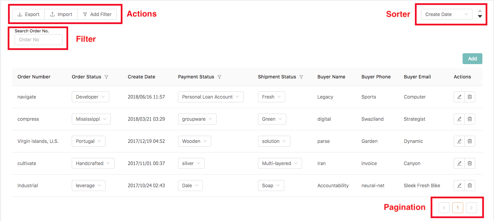
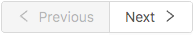
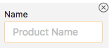
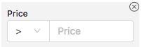
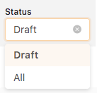
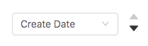
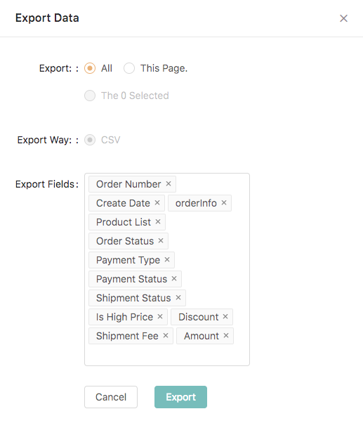
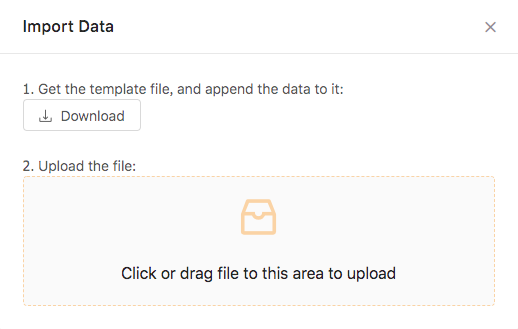

## Introduction

**Toolbar** tags provide additional features for users to build a powerful CMS to manipulate array data, such as `filter`, `sort`, `pagination`, `export`, `import`, ...etc.

> Notice that, `<toolbar/>` can only placed in [**first level array field**](schema-overview#first-level-tags) and [**relation field**](schema-data-type-tags#lt-relation-gt).




**Example**

```
<root>
  <array keyName="posts">
    <toolbar>
      <actions>
        <export {...exportProps}>
        <import {...importProps}>
        <filter />
      </actions>
      <sorter
        defaultField="createDate"
        options={[
          { label: "CreateDate", field: "createDate", defaultOrder: "desc" }
        ]}
      />
      <filter>
        <textFilter
          label="BuyerName"
          field="orderInfo.buyerName"
          placeholder="BuyerName"
        />
        <textFilter
          label="No"
          field="no"
          placeholder="Order No"
        />
      </filter>
      <pagination />
    </toolbar>
    {otherDataSchema}
  </array>
</root>

```

### Fetch Policy

There are two fetch policies, `sync` and `async`, of [**first level array field**](schema-overview#first-level-tags) and [**relation field**](schema-data-type-tags#lt-relation-gt). We use `sync` as default which means fetch all data at once, you can simply change it by adding `async` on toolbar tag, for example, `<toolbar async>`.

### Sync

**Fetch all data in initial request**, and all query features such as `filter`, `sorter`, and `pagination` are implemented in frontend. This policy is suitable for those whose data size is not huge (**You should consider using Async if your data points > 1000**), and who needs powerful query features.


### Async
**Fetch data with query**, changing `filter`, `sorter`, `pagination` will actually request server again. This policy is suitable for those whose data size is huge, so you don't want fetch them at once.

> Notice that the pagination in async haven't support calculate total paging feature yet. 



## &lt;filter /&gt;

There two usages of `<filter />`:
1. <b>Wraps the filters.</b> There are serveral filter tags such as [\<textFilter>](schema-toolbar-tags#lt-textfilter-gt), [\<numberFilter>](schema-toolbar-tags#lt-numberfilter-gt), and [\<selectFilter>](schema-toolbar-tags#lt-selectfilter-gt). They all should be wrapped by a `<filter />`.
2. <b>Add the control button in `<actions>`.</b> By default, all filters are invisible and controlled by the filter button in [`<actions>`](#lt-actions-gt).


### Usage
**With Control Button in &lt;Actions />**

```js
<root>
  <array keyName="posts">
    <toolbar>
      <actions>
        {/* add filter tag in actions to control the visibility of filters */}
        <filter /> 
      </actions>
      <filter>
        <textFilter
          label="BuyerName"
          field="orderInfo.buyerName"
          placeholder="BuyerName"
        />
      </filter>
    </toolbar>
    {otherDataSchema}
  </array>
</root>
```

**With AlwaysDisplay Property**

```js
<root>
  <array keyName="posts">
    <toolbar>
      <filter>
        {/* add `alwaysDisplay` property to let the filter become visible */}
        <textFilter
          label="BuyerName"
          field="orderInfo.buyerName"
          placeholder="BuyerName"
          alwaysDisplay 
        />
      </filter>
    </toolbar>
    {otherDataSchema}
  </array>
</root>
```

### Filter Query Object

In Canner, we use filter query object to represent a specific query. The object is composed with data and filter comparison, such as **eq, lt, gt**, ...etc.

For example, a query object to find those price is greater than 300 will be:

```js
{
  price: {
    gt: 300
  }
}
```

And it can also be nested.
```js
{
  info: {
    price: {
      gt: 300
    },
    createDate: {
      gt: '2018-10-03T08:00:18+00:00'
    }
  }
}
```

#### Filter Tags

- [\<textFilter>](schema-toolbar-tags#lt-textfilter-gt): Text filter
- [\<numberFilter>](schema-toolbar-tags#lt-numberfilter-gt): Number filter
- [\<selectFilter>](schema-toolbar-tags#lt-selectfilter-gt): Selection filter


#### Comparisons
- `gt`: greater than
- `gte`: greater than or equal to
- `lt`: less than
- `lte`: less than or equal to
- `eq`: equal to
- `contains`: use `indexOf` method, only supported in sync for now


### &lt;textFilter /&gt;



For string field, this filter generates a text input, has a different behavior in `sync` and `async` mode.

- `sync` mode: `eq` comparison
- `async` mode: `contains` comparison

**Properties**

- `field`: the key name of a string field you want to query
- `placeholder`: the placeholder of text input, support [i18n](guides-internationalization.md)
- `label`: the label of text input, support [i18n](guides-internationalization.md)
- `alwaysDisplay`: filter is hidden by default, you can set alwaysDisplay true to let it visible. 


**Example**
```js
<array keyName="users">
  <filter>
    <textFilter field="name" label="Name" placeholder="name" alwaysDisplay/>
  </filter>
  <string keyName="name" />
</array>
```

### &lt;numberFilter /&gt;



For number field, there are four comparisons in this filter.
- `gt`
- `gte`
- `lt`
- `lte`

**Properties**

- `field`: the key name of a number field you want to query
- `placeholder`: the placeholder of the number input, support [i18n](guides-internationalization.md)
- `label`: the label of the number input, support [i18n](guides-internationalization.md)
- `alwaysDisplay`: filter is hidden by default, you can set alwaysDisplay true to let it visible. 

**Example**
```js
<array keyName="products">
  <actions>
    <filter />
  </actions>
  <filter>
    <textFilter field="price" label="Price" placeholder="price" />
  </filter>
  <number keyName="price" />
</array>
```

### &lt;selectFilter /&gt;



Generate a selector which has options with query object.

**Properties**

- `options`: `Array<{text: string, condition: queryObject}>`
- `defaultOptionIndex`: the index of default option
- `label`: the label of the number input, support [i18n](guides-internationalization.md)
- `alwaysDisplay`: filter is hidden by default, you can set alwaysDisplay true to let it visible. 

**Example**

```js
<array>
  <toolbar>
    <filter>
      <selectFilter
        alwaysDisplay
        defaultOptionIndex={0}
        label="Status"
        options={[
          {
            text: "Draft",
            condition: {
              draft: {
                eq: true
              }
            }
          },
          {
            text: "All",
            condition: {
            }
          }
        ]}
      />
    </filter>
  </toolbar>
  <boolean keyName="draft" />
</array>
```

## &lt;sorter /&gt;



**Properties**
- `defaultField`: the keyName of the default sorted field
- `options`: `Array<{label: string, field: string, defaultOrder: 'ASC' | 'DESC'}>`

**Example**
```js
<array>
  <toolbar>
    <sorter
      defaultField="createDate"
      options={[
        { label: "CreateDate", field: "createDate", defaultOrder: "DESC" }
      ]}
    />
  </toolbar>
</array>
```

## &lt;pagination /&gt;

Pagination is the most basic query, so `<array>` and `<relation>` will add it by default even you don't write `<toolbar />` with `<pagination/>` in it.

```js
<root>
  <array keyName="users">
    <string keyName="name" />
  </array>
</root>
```

is the same as

```js
<root>
  <array keyName="users">
    <toolbar>
      <pagination />
    </toolbar>
    <string keyName="name" />
  </array>
</root>
```

## &lt;actions /&gt;


For now we support three actions, `filter`, `export`, and `import`.

### &lt;filter /&gt;
The `filter` tag in actions is used to control the filters appear or not. So if you want to use filter feature, remember to add this tag or all filters are hidden by default.

### &lt;export /&gt;



**Properties**
- `title`: the title of the modal
- `filename`: the CSV filename
- `fields`: `Array<{keyName: string, title: string, render?: (value: any) => string}>`

**Example**

```js
<root>
  <array keyName="products">
    <toolbar>
      <actions />
      <export
        fields={[{
          keyName: 'name',
          title: 'Name'
        }, {
          keyName: 'price',
          title: 'Price',
          render: v => `$ ${price}`
        }]}
        title="Export Modal"
        filename="Products"
      />
    </toolbar>
    <string keyName="name" />
    <number keyName="price" />
  </array>
</root>
```

### &lt;import /&gt;



**Properties**
- `title`: the title of the modal
- `filename`: the template csv filename
- `fields`: `Array<{keyName: string, title: string>`

**example**

```js
<root>
  <array keyName="products">
    <toolbar>
      <actions />
      <import
        fields={[{
          keyName: 'name',
          title: 'Name'
        }, {
          keyName: 'price',
          title: 'Price'
        }]}
        title="Import Modal"
        filename="Products"
      />
    </toolbar>
    <string keyName="name" />
    <number keyName="price" />
  </array>
</root>
```